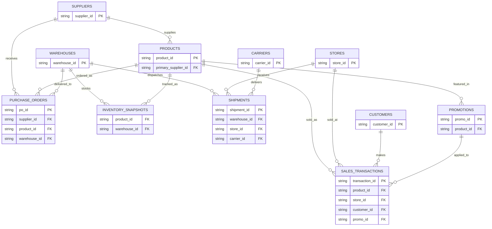

# 🗂️ Schema Design

## 🤔 Why 11 tables, not fewer

An earlier draft of this pipeline used 10 tables and folded carrier information directly
into `shipments` as a text column (`carrier_name`). That was reworked once it became clear
carrier-level attributes (base reliability, region specialization) needed to persist and be
reused across many shipments — a classic sign a value belongs in its own dimension table,
not repeated inline. `carriers` became table #11.

The guiding principle throughout: **a table exists if a real business process would keep
that data as its own system-of-record**, not just because "more tables looks more complex."
Procurement, warehousing, logistics, and retail sales are genuinely different operational
functions in a real company, each with its own natural entity.

## 📋 The 11 tables

| Table | Grain | Owns |
|---|---|---|
| `stores` | 1 row per store | store attributes (type, region, size) |
| `warehouses` | 1 row per warehouse | warehouse attributes (region, capacity) |
| `suppliers` | 1 row per supplier | supplier attributes, contract terms |
| `products` | 1 row per SKU | product catalog, pricing, primary supplier |
| `customers` | 1 row per customer | customer attributes, preferred store |
| `carriers` | 1 row per carrier | carrier base reliability |
| `purchase_orders` | 1 row per PO | supplier → warehouse restocking event |
| `inventory_snapshots` | 1 row per (product, warehouse, date) | stock level over time |
| `shipments` | 1 row per shipment | warehouse → store logistics event |
| `promotions` | 1 row per campaign | discount campaign definition |
| `sales_transactions` | 1 row per line-item sale | store → customer sale (the largest table) |

## 🔗 Entity relationships



GitHub renders the diagram above automatically (Mermaid support built in) — no image file needed.
A simplified text version, for anywhere Mermaid isn't supported:

```
suppliers ──< products ──< purchase_orders >── warehouses ──< inventory_snapshots

                  │                                │
                  │                                └──< shipments >── stores ──< sales_transactions >── customers
                  │                                                                     │
                  └─────────────────────────< promotions >───────────────────────────────┘
                                                                    carriers ──< shipments
```

Every table connects back to `products`, `stores`, or both — this is deliberate. It's what
makes a finding in one table traceable into another (e.g., a supplier's reject rate rising
→ visible in `purchase_orders` → causes gaps in `inventory_snapshots` → suppressed sales in
`sales_transactions` for that product at stores served by that warehouse).

## 🧩 Key design decisions

- **`inventory_snapshots` has mixed granularity** (daily for the ~20-25 products sourced
  from a "risk" supplier, weekly for everything else). This was a direct fix for an earlier
  design flaw: a 2-5 day stockout lag couldn't be captured at weekly granularity, so daily
  tracking was added specifically where the downstream stockout-tracing story requires it.
  This is documented, not left implicit — see `snapshot_granularity` column.

- **`warehouses` map to specific regions they serve** (not a free-for-all — each of the 3
  warehouses primarily serves 2 of the 6 regions), because the logistics/route-delay story
  needed a concrete geography to compute cross-region delay penalties against.

- **Products have a single `primary_supplier_id`**, not a many-to-many supplier
  relationship. This is a simplification: real retail catalogs sometimes multi-source a
  SKU, but single-sourcing keeps the supplier-risk → product → downstream-effect chain
  traceable without needing to model sourcing-mix decisions, which was out of scope.
